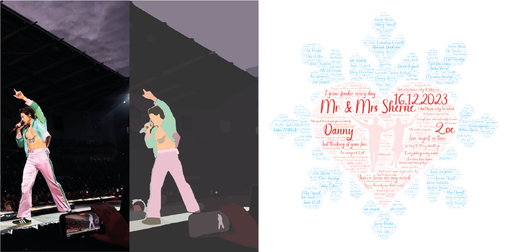

## Hi there 👋

My name is Max, a Research Software Engineer and HPC support member at Imperial College London helping researchers solve parallel processing issues and streamline their research software scripts into fully fledged open-source software fit for the wider community.

I completed my PhD at the University of Sheffield in the [Pyne Lab](https://pyne-lab.uk/) where I helped uncover the role of DNA shape in self- and protein interactions through automated image analysis pipelines. I studied Physics at the University of Leeds during my undergraduate and Masters degree where I was introduced to Python and developed a love for scripting, coding and now software development.

- 📫 **How to reach me:** 
  - maxgamill(at)live.com

- 😄 **Pronouns:** he/him

- ⚡ **Fun fact:** In a stark contrast to coding, I love adrenaline sports such as trail running, mountain biking, climbing, and skiing.

## Git Stats

## Current Interests
- 🔭 **I'm currently working on:** image analysis workflows for atomic force microscopy images of DNA using [TopoStats](https://github.com/AFM-SPM/TopoStats/):

  

- 🌱 **I'm currently learning about:** computer vision deep-learning models and how auto-encoders could help with shape analysis via transfer learning (private repo until published):

  

## Additional Projects:
- Created from scratch an interactive portfolio website showcasing early work such as; a simple feed-forward neural network to classify hand-drawn numbers trained on the MNIST dataset, a susceptible, recovered and infected (SIR) disease model, and monte-carlo simulations to model the magnetic moments of a 1D spin Ising model.
  - A key challenge here was to create a frontend which could take client-side variables (and mouse-drawn canvases!) and send these to the appropriate python scripts to be processed on the Raspberry Pi server.
  - The project used: a HTML, CSS and JavaScript frontend, a Django and AJAX backend, hosted on a Ubuntu Raspberry Pi, equipped with an Apache gateway and port forwarding. (The webserver is currently down to free up the Raspberry Pi for other projects). Source code available [here](https://github.com/Max-gamill/Django-Portfolio).

- (In progress) Creating from scratch an marketplace for personalised artwork / photo editing using a variety of algorithms and machine learning models (no generative models!). Once complete I hope that people would be able to apply funky filters to their own images and personalise them for cards / invitations such as those below:

  

